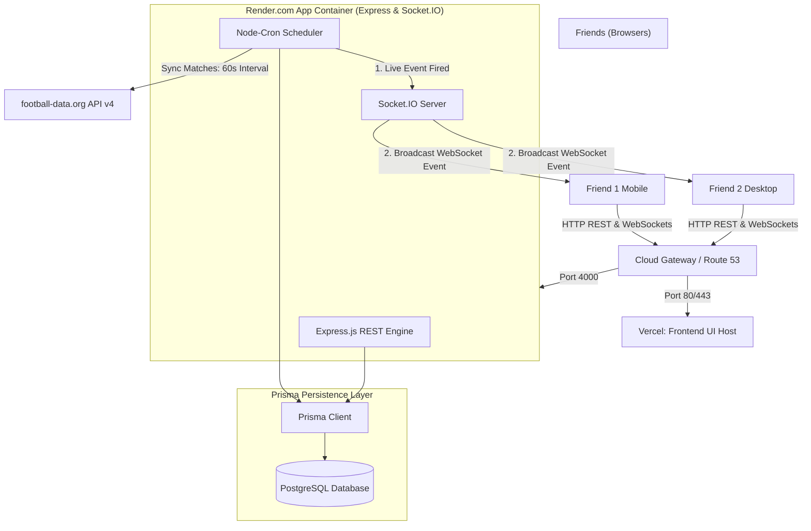

# ⚽ FIFA World Cup 2026 Fantasy Application — Technical Blueprint

This is the comprehensive, end-to-end technical blueprint for the **FIFA World Cup 2026 Fantasy Application**. It details exactly how the frontend, backend, database, security, and deployment pipelines work together to run **24/7 for 10 friends**.

---

# ⚽ System Architecture & Real-Time Data Flow

The system operates as a decoupled full-stack monorepo: a **Next.js 15 SPA (Single Page Application)** on the frontend, an **Express.js API + Socket.IO Server** on the backend, and **Prisma ORM** managing data persistence.



---

# 1. Backend Engine (Express, Socket.IO & Node-Cron)

The backend runs as a stateful Node.js application inside an Express container. It handles data sync, points engine calculations, REST routing, and WebSockets.

### ⚙️ Core Technical Specifications
*   **Location**: `backend/`
*   **Startup Commands**: `npm run build` followed by `npm start` (or `npm run dev` with nodemon watch)
*   **Port**: `4000` (Local) or dynamic `$PORT` environment variable in production.

---

### A. HTTP REST API
*   **Why**: Standardized endpoints for user authentication, CRUD operations on fantasy teams, roster adjustments, league management, and fetching match histories.
*   **When**: Every time a user loads a page, submits a team lineup, updates settings, or triggers page navigation.
*   **How**: Express routes map endpoints to controller logic. Data is validated on entry using `express-validator` middleware before being query-passed to Prisma.

---

### B. Socket.IO Real-Time Communication
*   **Why**: Avoids loading servers with HTTP polling requests. When a goal is scored in real life, your friends' browsers must update the dashboard and player stats immediately, without a page refresh.
*   **When**: Runs automatically on connection and stays open.
*   **How**:
    *   **JWT Handshake**: Clients connect to `ws://<backend-url>` passing their JWT token in `auth.token`. The socket verifies this token before allowing the connection.
    *   **Room Subscriptions**:
        *   `user:${userId}`: Auto-joined by the verified user's socket to receive secure point updates and notifications.
        *   `match:${matchId}`: Joined when a user visits a specific match panel. Listens for live events (`event:new`) and score changes.
        *   `league:${leagueId}`: Joined when a user views a private mini-league leaderboard. Emits refreshes (`leaderboard:update`) when fantasy points change.

---

### C. Live Sync: Node-Cron Scheduler
*   **Why**: Fetches real-world match events automatically.
*   **When**: Fires **every 60 seconds** on the cron expression `* * * * *`.
*   **How**:
    1. Node-cron schedules a loop targeting the Football API service.
    2. Calls `https://api.football-data.org/v4/competitions/2000/matches?status=LIVE` using Axios.
    3. If matches are active, it queries details for each match and parses the JSON response for new events (goals, assists, cards, missed penalties).
    4. Automatically writes new `MatchEvent` entities to the database, ensuring each event is logged only once via the `processedEvents` unique tracker.

---

### D. Fantasy Scoring Engine
*   **Why**: Translates real performance metrics into competitive fantasy values.
*   **When**: Instantly executed after any new `MatchEvent` (goals, cards, clean sheets) is registered by the Cron scheduler or manually added by the Admin panel.
*   **How**:
    1. Recalculates stats in the `MatchPlayer` table for the specific match.
    2. Loops through all user `FantasyTeam` lineups submitted for that match.
    3. Tallies scores using the matrix:
        $$\text{Total Points} = (10 \times \text{Goals}) + (5 \times \text{Assists}) + (4 \times \text{Clean Sheets GK/DEF}) - (2 \times \text{Yellow Cards}) - (5 \times \text{Red Cards}) - (4 \times \text{Penalty Misses})$$
    4. Applies multipliers: **Captain (2.0x)** and **Vice-Captain (1.5x)**.
    5. Sums up all match scores into the `User.totalPoints` field.
    6. Calls `emitPointsUpdate(userId, matchId, totalPoints)` and `emitLeaderboardUpdate(leagueId)` to broadcast real-time state changes via WebSockets.

---

# 2. Frontend Application (Next.js 15 & React 19)

The UI is built with Next.js 15 using the modern App Router architecture, Styled with Tailwind CSS, and powered by React 19 Client Components.

### ⚙️ Core Technical Specifications
*   **Location**: `frontend/`
*   **Startup Commands**: `npm run build` followed by `npm start` (or `npm run dev` for dev server)
*   **Port**: `3000` (Local)

---

### Key Page Routes

```
frontend/src/app/
├── layout.tsx                # App Root (State Providers & Hot Toasters)
├── page.tsx                  # Landing Page & Public Overview
├── login/                    # Credentials Login / OAuth Sign-in Gateway
├── signup/                   # User Registration Panel
├── dashboard/                # Main Panel (Personal Standings, Fast Navigation)
├── matches/                  # Tournament Roster (Filterable List & Bracket view)
├── leagues/                  # Mini-Leagues Hub (Join/Create private spaces)
│   └── [id]/                 # Active League Leaderboards
├── profile/                  # User Settings, PWA configurations, VAPID Subscriptions
└── team-builder/
    └── [matchId]/            # 11-Player Squad Roster Editor & Roster Lock
```

---

### 🎨 Visual & Styling System
*   **Theme**: Sleek, modern dark-mode (`#0A0A0F` dark space base) using glassmorphism effects (`backdrop-filter: blur()`), vibrant border gradients, and responsive layouts.
*   **Typography**: Clean sans-serif sans fonts (Inter / Outfit) for maximum legibility on mobile viewports.
*   **Components**: Dynamic UI micro-animations and loading skeleton systems handled via Framer Motion and React transitions.

---

# 3. Database Architecture (Prisma + SQLite/Postgres)

We use Prisma ORM to interact with our database. The local development environment runs on **SQLite** (`dev.db`), and in production, we migrate to a hosted **PostgreSQL** database.

```
                  ┌─────────────────────────────────┐
                  │              User               │
                  └────────────────┬────────────────┘
                                   │ 1
                                   │
                                   │ *
                  ┌────────────────┴────────────────┐
                  │           FantasyTeam           │
                  └────────────────┬────────────────┘
                                   │ 1
                                   │
                                   │ *
                  ┌────────────────┴────────────────┐
                  │           TeamPlayer            │
                  └────────────────┬────────────────┘
                                   │ *
                                   │
                                   │ 1
                  ┌────────────────┴────────────────┐
                  │             Player              │
                  └────────────────┬────────────────┘
                                   │ 1
                                   │
                                   │ *
                  ┌────────────────┴────────────────┐
                  │           MatchPlayer           │
                  └────────────────┬────────────────┘
                                   │ *
                                   │
                                   │ 1
                  ┌────────────────┴────────────────┐
                  │              Match              │
                  └─────────────────────────────────┘
```

### 📋 Main Schema Models & Relationships

| Entity | Attributes | Relations |
|--------|------------|-----------|
| **User** | ID, Name, Email, PasswordHash, totalPoints, isAdmin | Has many `FantasyTeams`, owns `Leagues`, belongs to `Leagues` through `LeagueMember`. |
| **Match** | ID, Home/Away Teams, kickoffTime, status (`UPCOMING`/`LIVE`/`COMPLETED`), homeScore, awayScore, round | Has many `FantasyTeams` submitted, many `MatchPlayers`, and many logged `MatchEvents`. |
| **Player** | ID, Name, Country, position (`GK`/`DEF`/`MID`/`FWD`), price, basePoints | Linked in `TeamPlayer` arrays and accumulates match stats in `MatchPlayer`. |
| **MatchPlayer**| ID, matchId, playerId, goals, assists, cleanSheet, yellowCards, redCards, fantasyPoints | Pivot mapping real player stats to a specific `Match`. |
| **FantasyTeam**| ID, userId, matchId, captainId, viceCaptainId, totalPoints, budgetUsed | Stores the user's specific 11-player lineup submitted for a single match. |

---

# 4. Security Architecture

To keep the application secure for you and your friends, multiple layers of defensive programming are implemented:

```
                  ┌───────────────────────────────┐
                  │        Incoming Request       │
                  └───────────────┬───────────────┘
                                  │
                                  ▼
                  ┌───────────────────────────────┐
                  │      CORS / Origin Check      │
                  └───────────────┬───────────────┘
                                  │
                                  ▼
                  ┌───────────────────────────────┐
                  │    Express-Rate-Limit Node    │
                  └───────────────┬───────────────┘
                                  │
                                  ▼
                  ┌───────────────────────────────┐
                  │    JWT Handshake Validation   │
                  └───────────────┬───────────────┘
                                  │
                                  ▼
                  ┌───────────────────────────────┐
                  │   express-validator Schemas   │
                  └───────────────┬───────────────┘
                                  │
                                  ▼
                  ┌───────────────────────────────┐
                  │  Prisma Database Query Execution│
                  └───────────────────────────────┘
```

1.  **Authentication**:
    *   Passwords are encrypted using **bcryptjs** (10 salt rounds) before database storage.
    *   Auth sessions use **JWT Tokens** containing the payload: `userId`, `email`, and `isAdmin`. Tokens are signed using a secure 48-byte cryptographic key.
2.  **Cross-Origin Resource Sharing (CORS)**:
    *   Strictly configured to allow requests only from verified clients (like your frontend domain) and rejects unauthorized web origins.
3.  **API Rate Limiting**:
    *   `express-rate-limit` prevents brute-force login attempts and DDoS attacks by limiting requests to 100 queries per 15-minute window for standard users.
4.  **SQL Injection Prevention**:
    *   Prisma ORM parameterizes all queries automatically. SQL injections are structurally impossible.
5.  **Payload Validation**:
    *   `express-validator` blocks invalid input payloads before they reach business logic. For example, the `/subscribe` endpoint validates push endpoints to ensure only valid URL structures are accepted.

---

# 5. Production Deployment & CI/CD Pipeline

To run the app **24/7** for 10 friends with zero downtime, use a cloud hosting configuration:

### 🚀 Production Deployment Map

```
                                  ┌────────────────────────┐
                                  │   GitHub Monorepo Push │
                                  └───────────┬────────────┘
                                              │
                     ┌────────────────────────┴────────────────────────┐
                     │                                                 │
                     ▼                                                 ▼
        ┌─────────────────────────┐                       ┌─────────────────────────┐
        │   Vercel Build Hook     │                       │    Render Build Hook    │
        └────────────┬────────────┘                       └────────────┬────────────┘
                     │                                                 │
                     ▼                                                 ▼
        ┌─────────────────────────┐                       ┌─────────────────────────┐
        │ Compile Static Next.js  │                       │   Build Docker Node.js  │
        └────────────┬────────────┘                       └────────────┬────────────┘
                     │                                                 │
                     ▼                                                 ▼
        ┌─────────────────────────┐                       ┌─────────────────────────┐
        │ Distribute CDN Edge UI  │                       │ Run Database Migrations │
        └─────────────────────────┘                       └────────────┬────────────┘
                                                                       │
                                                                       ▼
                                                          ┌─────────────────────────┐
                                                          │ Start Express / Sockets │
                                                          └─────────────────────────┘
```

#### 1. Frontend UI Host: Vercel (Fastest & Free)
*   **Why**: Zero-configuration static hosting, fast Global Edge Network, automatically processes Next.js Server Components.
*   **Setup**: Point Vercel to your Github monorepo, select `/frontend` as the root directory, and deploy.

#### 2. Backend & Socket Server: Render.com or Railway.app (Free/Cheap)
*   **Why**: Handles persistent processes like WebSocket servers (`ws://`) and cron schedulers. Static hosting sites like Vercel Serverless Functions do not support persistent WebSockets or cron schedules.
*   **Setup**: Deploy `/backend` as a **Web Service**. Configure health checks to ping the `/health` endpoint to verify service uptime.

#### 3. Database: Supabase or Neon (Free Postgres Tier)
*   **Why**: SQLite is stored as a local file. On platforms like Render or Railway, container files are erased and reset whenever code is pushed or servers restart. A dedicated hosted PostgreSQL DB is permanent.
*   **Migrating SQLite to Postgres**:
    1. In `backend/prisma/schema.prisma` change provider from `"sqlite"` to `"postgresql"`.
    2. Change the Database URL inside `.env` to point to your new database.
    3. Run `npx prisma db push` and `npx prisma db seed` to deploy schema structure and populate the 104 matches and 720 players in production.

---

### 🛠️ Step-by-Step CI/CD System Setup

Here is how to get this repository live:

#### Step 1: Create your GitHub Repository
Create a new private/public repository on GitHub.
```bash
git init
git add .
git commit -m "feat: production-ready World Cup App"
git remote add origin https://github.com/<your-username>/world-cup-fantasy-2026.git
git branch -M main
git push -u origin main
```

#### Step 2: Set Up Production Environment Variables

Ensure your production environment has the correct configurations:

##### 🔴 Backend Configs (Render/Railway Env Settings)
```ini
DATABASE_URL=postgresql://postgres:<password>@<db-host>:5432/postgres
JWT_SECRET=8Wi9rI7wMGpD832PY5dxOrE7ak4t1n9CTLmmrYWHbO+W0+WS0i3hEnU+QN17Lw17
PORT=4000
NODE_ENV=production
CLIENT_URL=https://your-frontend-vercel-app.vercel.app
API_URL=https://your-backend-render-app.onrender.com
FOOTBALL_API_KEY=your_real_football_api_key_from_data_org
VAPID_PUBLIC_KEY=your_generated_vapid_public_key
VAPID_PRIVATE_KEY=your_generated_vapid_private_key
VAPID_MAILTO=mailto:your_email@gmail.com
```

##### 🔵 Frontend Configs (Vercel Env Settings)
```ini
NEXT_PUBLIC_API_URL=https://your-backend-render-app.onrender.com
```

Whenever you push new code to your GitHub repository (`git push`), Vercel and Render will automatically detect the changes, build the application, and update it live with zero downtime.
